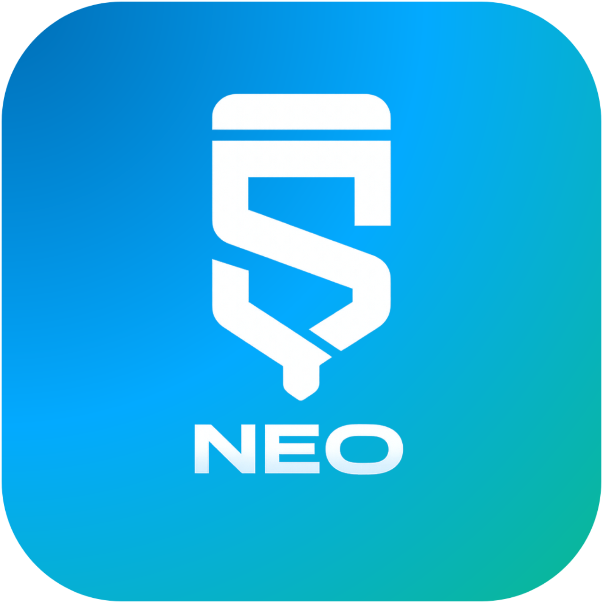

<p align="center">
  
</p>

# Sketchware Neo

[](https://github.com/sketchlibx/SketchwareNeo/graphs/contributors)
[](https://github.com/sketchlibx/SketchwareNeo/commits/)
[](https://github.com/sketchlibx/SketchwareNeo/releases/latest)
[](https://github.com/sketchlibx/SketchwareNeo/releases)
[](https://github.com/sketchlibx/SketchwareNeo)
[](https://t.me/sketchwareneo)

**Sketchware Neo** is a community-maintained Android IDE that lets you build real Android apps — entirely from your Android device. No desktop required.

It began as a continuation of Sketchware Pro (itself a fork of the original Sketchware), and has since grown into something significantly more powerful. With the original Sketchware ecosystem largely inactive, Sketchware Neo is where active development is happening: modern features, proper tooling, and long-term support.

---

## What's New in Sketchware Neo

Beyond what Sketchware Pro offered, Sketchware Neo adds:

**Editor & Code**
- Improved multi-language source code editor (C, C++, Kotlin, Groovy, CMake, Markdown, JSON…)
- C/C++ (JNI) Manager with full CMake integration
- Custom Java Manager
- Java ↔ Blocks synchronization *(ongoing)*

**Build System**
- Custom Gradle support
- Local Library Manager with AAR/JAR support
- Code Shrinking (R8 / ProGuard) with template keep-rules
- Android Studio Project Importer *(ongoing)*

**Project Management**
- AndroidManifest Editor
- Resource Usage Tracker
- Cloud Backup system
- Layout Preview
- Global Search

**Tooling & Workflow**
- Git client integration
- Performance improvements throughout
- Many bug fixes from the upstream forks

**Extensibility**
- Plugin system — drop in an external `.jar`/`.apk` and it loads at runtime, no rebuild needed. Plugins can add entries to the Managers drawer and hook into build success/failure. Still early: a plugin can't bring its own full-screen UI yet, and code-block injection works structurally but hasn't been proven against a real block spec.

> This list isn't exhaustive. Most active development happens in the `mod` package. Check recent commits for the latest.

---

## Roadmap

The following areas are actively being worked on or planned:

| Status | Feature |
|--------|---------|
| 🔄 In Progress | Java ↔ Blocks bidirectional conversion |
| 🔄 In Progress | Android Studio Project Importer |
| 🔄 In Progress | Git client improvements |
| 📋 Planned | On-device native (NDK) compilation via Termux |
| 📋 Planned | Full Kotlin project support |
| 📋 Planned | Compose UI preview |
| 📋 Planned | Better error reporting across the build pipeline |

If you want to work on something not listed here, open a Discussion first so we can coordinate.

---

## Building the App

To build the app, you need Gradle. Android Studio is strongly recommended.

```bash
git clone https://github.com/sketchlibx/SketchwareNeo.git
cd SketchwareNeo
./gradlew assembleDebug
```

### Source Code Map

| Class | Role |
|-------|------|
| `a.a.a.ProjectBuilder` | Compiles an entire Sketchware project into an APK |
| `a.a.a.Ix` | Generates `AndroidManifest.xml` |
| `a.a.a.Jx` | Generates activity source code |
| `a.a.a.Lx` | Generates component code (listeners, etc.) |
| `a.a.a.Ox` | Generates XML layout files |
| `a.a.a.qq` | Registry of built-in library dependencies |
| `a.a.a.tq` | Compiling dialog quiz strings |
| `a.a.a.yq` | Manages Sketchware project file paths |
| `neo.sketchware.plugin.PluginManager` | Loads and manages external plugins via `DexClassLoader` |
| `neo.sketchware.plugin.NeoPluginInterface` | The contract a plugin implements to hook into the IDE |

> [!TIP]
> The `mod` package contains the majority of contributor changes. If you're looking for a specific feature, it's likely there.

---

## Writing Plugins

Sketchware Neo can load plugins at runtime — no rebuild, no updating the base APK. A plugin is a `.jar` or `.apk` with a class implementing `NeoPluginInterface`, plus a `plugin.json` sitting at its root:

```java
public interface NeoPluginInterface {
    String getPluginId();
    int getPluginApiVersion();
    void onLoad(NeoPluginContext context) throws Exception;
    void onUnload();
    // optional: getDrawerEntries(), getBlockContributions(), onBuildError(), onBuildSuccess()
}
```

```json
{
  "pluginId": "com.example.myplugin",
  "entryClass": "com.example.myplugin.MyPlugin",
  "apiVersion": 1
}
```

Build it however you like — a plain Android app module works fine, `assembleDebug` already produces valid DEX. Drop the resulting file into `.sketchware/plugins/` on the device, or install it from **App Settings → Plugins** (also reachable from the Managers drawer inside a project). It loads immediately, and you can enable, disable, or remove it from the same screen.

Two things aren't there yet: a plugin can't bring its own full-screen Activity (Android doesn't really let you register new Activities at runtime without some ugly workarounds), and block/palette injection is wired up but hasn't been checked against a real block spec. If you're poking at either of these, open a Discussion and tell us what broke.

---

## Contributing

Contributions are welcome and appreciated. Whether it's a bug fix, a new feature, or a documentation improvement — every bit helps.

### Steps

1. Fork this repository.
2. Create a feature branch: `git checkout -b feat/your-feature-name`
3. Make your changes and test them on a real device or emulator.
4. Commit using the convention below.
5. Open a Pull Request — describe what you changed and why.

Pull requests are reviewed by maintainers. Please be patient; we aim to review promptly.

### What We're Looking For

- Bug fixes and stability improvements
- Performance improvements
- UI/UX improvements
- New editor or compiler features
- Gradle / build system improvements
- Documentation and code comments
- Testing and regression coverage

No contribution is too small. If you're unsure whether something is worth submitting, open an Issue or Discussion first.

### Commit Message Convention

Use one of these prefixes:

| Prefix | Use for |
|--------|---------|
| `feat:` | A new feature or enhancement |
| `fix:` | A bug fix |
| `style:` | Styling or formatting changes |
| `refactor:` | Code restructuring without behaviour change |
| `perf:` | Performance improvements |
| `test:` | Test-related changes |
| `docs:` | Documentation only |
| `chore:` | Maintenance, dependency updates |

Examples:
- `feat: Add keep-rule template picker to ProGuard manager`
- `fix: Fix crash on launch when no projects exist`
- `refactor: Simplify block ID mapping in LogicEditorActivity`

> [!IMPORTANT]
> New features that don't need to touch existing packages should go into `pro.sketchware`, respecting the existing directory and file naming conventions. Prefer Java over Kotlin unless Kotlin is clearly the better fit for the task. The one exception is bigger, self-contained subsystems (like the plugin system, under `neo.sketchware.plugin`) — those get their own `neo.sketchware.*` package so they stay easy to find and don't get tangled up with everything else.

---

## Community & Support

For discussions, help, feature suggestions, and community updates, visit:

**[sketchlib.in](https://sketchlib.in)**

For development-related communication, prefer:
- **GitHub Issues** — bug reports, feature requests
- **GitHub Discussions** — ideas, questions, general dev talk
- **Pull Requests** — code contributions

---

## Disclaimer

Sketchware Neo is a community continuation of Sketchware, built to keep the project alive and moving forward. It is **not affiliated with or endorsed by the original Sketchware developers**.

This project is **source-available**, not fully open source. You may view, fork, and contribute to the code, but you may not redistribute Sketchware Neo — modified or unmodified — on the Play Store or any other app marketplace. See [LICENSE.md](LICENSE.md) for details.

We have a lot of respect for the original Sketchware team and what they built. This project exists because Sketchware hasn't received updates in a long time, and the community wanted to keep it going.
