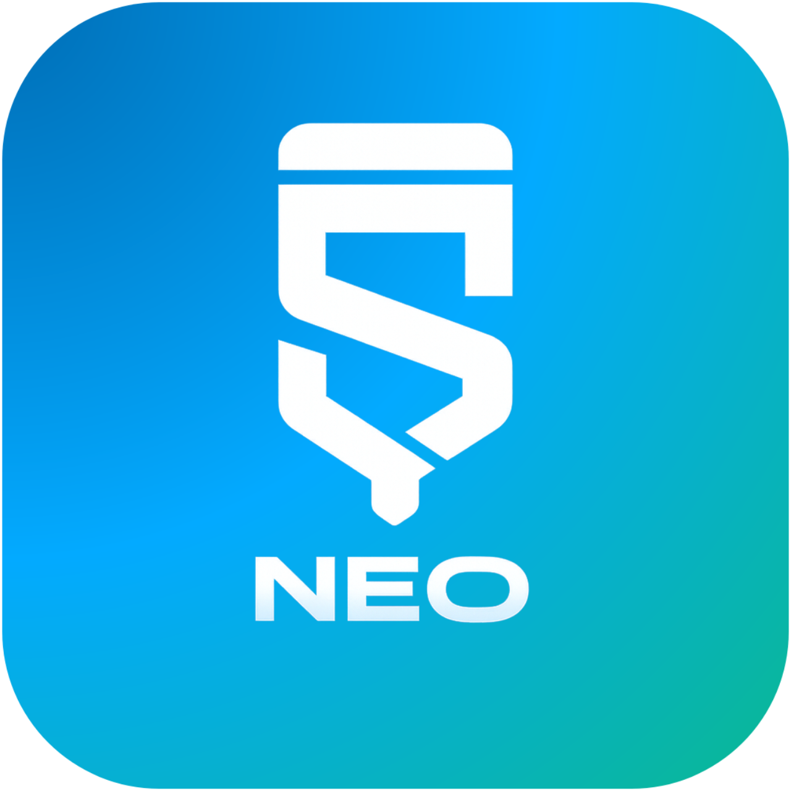

<p align="center">
  
</p>

# Sketchware Neo

[](https://github.com/sketchlibx/SketchwareNeo/graphs/contributors)
[](https://github.com/sketchlibx/SketchwareNeo/commits/)
[](https://github.com/sketchlibx/SketchwareNeo/releases/latest)
[](https://github.com/sketchlibx/SketchwareNeo/releases)
[](https://github.com/sketchlibx/SketchwareNeo)
[](https://t.me/sketchwareneo)

<p align="center">
  <b>A modified version of Sketchware Pro for Android</b>
</p>

<p align="center">
<a href="https://github.com/fora2323/Sketchware-DayGreen/blob/main/LICENSE">
  
</a>
  </a>
  
  <a href="https://github.com/fora2323/Sketchware-DayGreen/releases">
    
  </a>
</p>

<p align="center">
  <a href="https://t.me/sketchware_daygreen">
    
  </a>
  <a href="https://discord.gg/V4ePcgaCq">
    
  </a>
</p>

# Important!
Based on and always including updates from [Sketchware Pro](https://github.com/Sketchware-Pro/Sketchware-Pro). Please backup all your projects if using this version. We will not be responsible if any unexpected problems occur.

# Sketchware Pro

Welcome to Sketchware Pro! Here you'll find the source code of many classes in Sketchware Pro and, most importantly, the place to contribute to Sketchware Pro.

## Building the App
To build the app, you must use Gradle. It's highly recommended to use Android Studio for the best experience.

### Source Code Map

| Class           | Role                                        |
| --------------- | ------------------------------------------- |
| `a.a.a.ProjectBuilder`      | Helper for compiling an entire project       |
| `a.a.a.Ix`      | Responsible for generating AndroidManifest.xml |
| `a.a.a.Jx`      | Generates source code of activities          |
| `a.a.a.Lx`      | Generates source code of components, such as listeners, etc. |
| `a.a.a.Ox`      | Responsible for generating XML files of layouts |
| `a.a.a.qq`      | Registry of built-in libraries' dependencies |
| `a.a.a.tq`      | Responsible for the compiling dialog's quizzes |
| `a.a.a.yq`      | Organizes Sketchware projects' file paths    |


## Writing Plugins

Sketchware Neo can load plugins at runtime — no rebuild, no updating the base APK. A plugin is a `.jar` or `.apk` with a class implementing `NeoPluginInterface`, plus a `plugin.json` sitting at its root:

```java
public interface NeoPluginInterface {
    String getPluginId();
    int getPluginApiVersion();
    void onLoad(NeoPluginContext context) throws Exception;
    void onUnload();
    // optional: getDrawerEntries(), getBlockContributions(), onBuildError(), onBuildSuccess()
}
```

```json
{
  "pluginId": "com.example.myplugin",
  "entryClass": "com.example.myplugin.MyPlugin",
  "apiVersion": 1
}
```

Build it however you like — a plain Android app module works fine, `assembleDebug` already produces valid DEX. Drop the resulting file into `.sketchware/plugins/` on the device, or install it from **App Settings → Plugins** (also reachable from the Managers drawer inside a project). It loads immediately, and you can enable, disable, or remove it from the same screen.

Two things aren't there yet: a plugin can't bring its own full-screen Activity (Android doesn't really let you register new Activities at runtime without some ugly workarounds), and block/palette injection is wired up but hasn't been checked against a real block spec. If you're poking at either of these, open a Discussion and tell us what broke.

---


> [!TIP]
> You can also check the `mod` package, which contains the majority of contributors' changes.

## Contributing

If you'd like to contribute to Sketchware Pro, follow these steps:

1. Fork this repository.
2. Make changes in your forked repository.
3. Test out those changes.
4. Create a pull request in this repository.
5. Your pull request will be reviewed by the repository members and merged if accepted.

We welcome contributions of any size, whether they are major features or bug fixes, but please note that all contributions will be thoroughly reviewed.

### Commit Message

When you make changes to one or more files, you need to commit those changes with a commit message. Here are some guidelines:

- Keep the commit message short and detailed.

> [!IMPORTANT]
> If you want to add new features that don't require editing other packages other than `pro.sketchware`, make your changes in `pro.sketchware` package, and respect the directories and files structure and names. Also, even though the project compiles just fine with Kotlin classes that you might add, try to make your changes or additions in Java, not Kotlin unless it is more than necessary.

## Thanks for Contributing

Thank you for contributing to Sketchware Pro! Your contributions help keep Sketchware Pro alive. Each accepted contribution will be noted down in the "About Team" activity. We'll use your GitHub name and profile picture initially, but they can be changed, of course.

## Disclaimer

This mod was not created for any harmful purposes, such as harming Sketchware; quite the opposite, actually. It was made to keep Sketchware alive by the community for the community. Please use it at your own discretion.

We do NOT permit publishing Sketchware Pro as it is, or with modifications, on Play Store or on any other app store. Keep in mind that this project is still a mod. Unauthorized modding of apps is considered illegal and we discourage such behavior.

We love Sketchware very much and are grateful to Sketchware's developers for creating such an amazing app. However, we haven't received updates for a long time. That's why we decided to keep Sketchware alive by creating this mod, and it's completely free. We don't demand any money :)